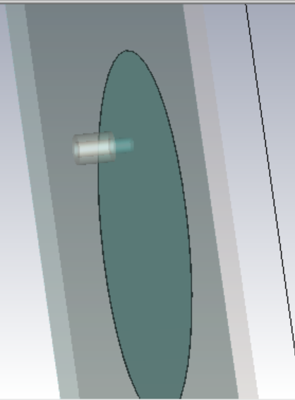
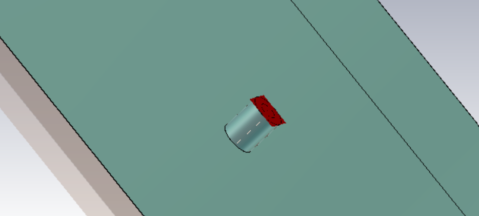
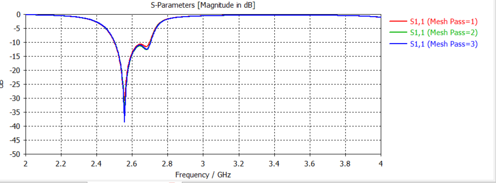
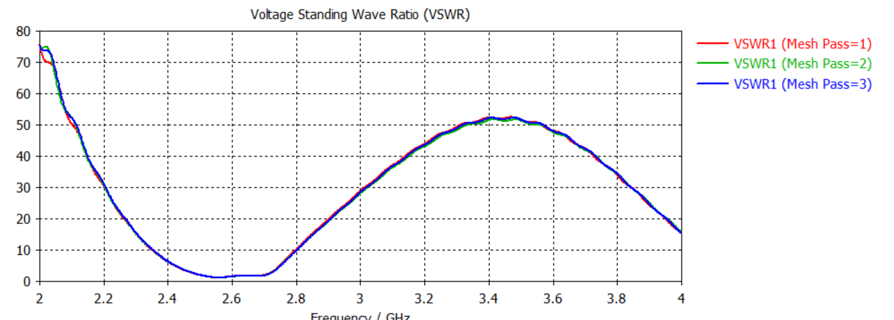
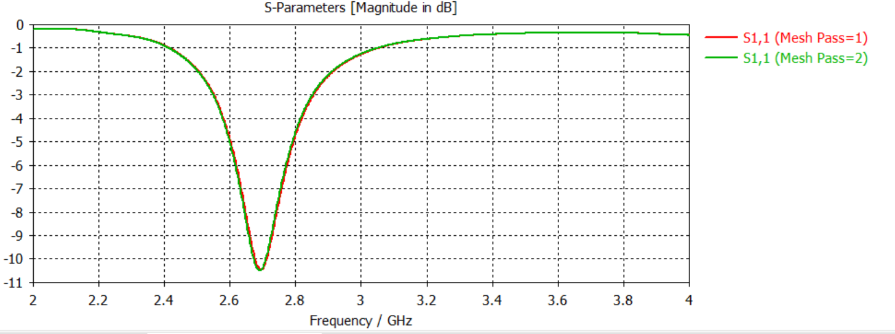

# Coaxial-Fed Microstrip Patch Antenna

Design and iterative feed optimization of a coaxially probe-fed microstrip patch antenna in **CST Studio Suite**, targeting the **2.4 GHz band**.

---

## 🎯 Design & Tuning Methodology

The coaxial probe feed location critically controls the antenna's input impedance $Z_{\text{in}}$ and resonance:
1. **Iteration 1 (Initial probe position):** Resonated at $2.70\text{ GHz}$ with a sub-optimal impedance match ($S_{11} \approx -10.5\text{ dB}$, $\text{VSWR} \approx 1.85$).
2. **Final Iteration (Optimized probe placement & patch tuning):** Iteratively shifted feed pin position and refined patch dimensions to achieve near-perfect $50\,\Omega$ matching.

### CST Model & Feed Construction
| Patch Structure | Coaxial Probe & Clearance Detail |
| :---: | :---: |
|  |  |

---

## 📊 Performance Comparison & Results

### Iteration 1 vs. Final Iterated Design

| Metric | Iteration 1 (Initial) | Final Design (Optimized) |
| :--- | :---: | :---: |
| **Resonant Frequency** | $2.70\text{ GHz}$ | $\mathbf{2.56\text{ GHz}}$ |
| **Return Loss ($S_{11}$)** | $-10.5\text{ dB}$ | $\mathbf{-38.0\text{ dB}}$ |
| **VSWR** | $\approx 1.85$ | $\mathbf{1.03}$ (Near Ideal) |
| **Mesh Validation** | 2 Passes | **3 Refinement Passes (Converged)** |

### 1. Final $S_{11}$ Return Loss
Achieved an exceptional deep resonance null of **$-38\text{ dB}$** at $2.56\text{ GHz}$, validating strong impedance matching.

### 2. Final VSWR
Voltage Standing Wave Ratio reached **$1.03$** at resonance (ideal is $1.00$).

### 3. Early Iteration ($2.7\text{ GHz}$) Baseline

---

## 📁 Repository Files

- `coaxial_patch_antenna.cst` : CST Studio Suite 3D simulation model file

- `geometry.png` : 3D perspective of the patch antenna
- `feed_detail.png` : Detailed view of coaxial feed pin and ground plane clearance
- `s11_final_2.56ghz.png` : High-precision converged S11 curve (Mesh passes 1 to 3)
- `vswr_final_2.56ghz.png` : Final VSWR curve showing 1.03 match
- `s11_iteration1_2.7ghz.png` : Baseline tuning stage plot
- `README.md` : Complete engineering report and tuning documentation

---
**Tool:** CST Studio Suite  
**Author:** Bollam Rakesh Balaji (NIT Mizoram)